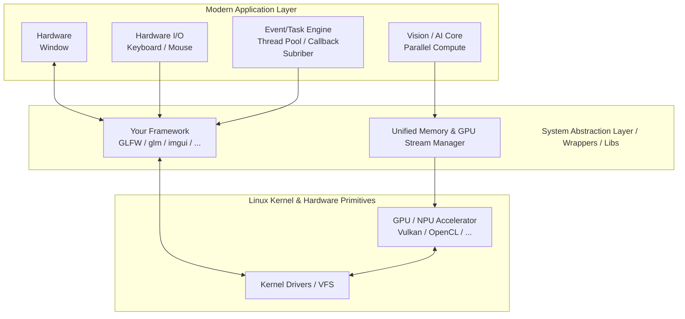

# CLOSED SOURCE - EXAMPLE of Haris Engine with GPU Acceleration

Feature: GPU Hardware Acceleration.
Target: Performance optimization and high-speed processing.


💡 Note: The quality and frame rate of this demo have been reduced to optimize file size for the repository.




## Build and Run example with libraries in HarisEngine package.

```sh
cd example/
./cmake_build_and_run.sh
```
